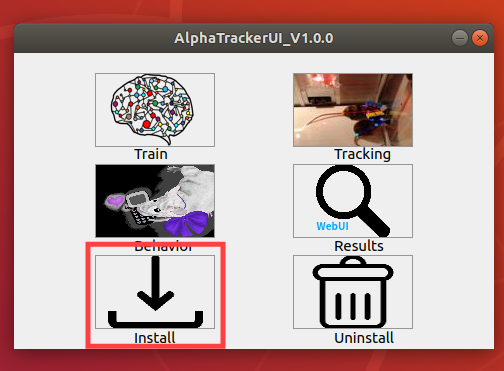
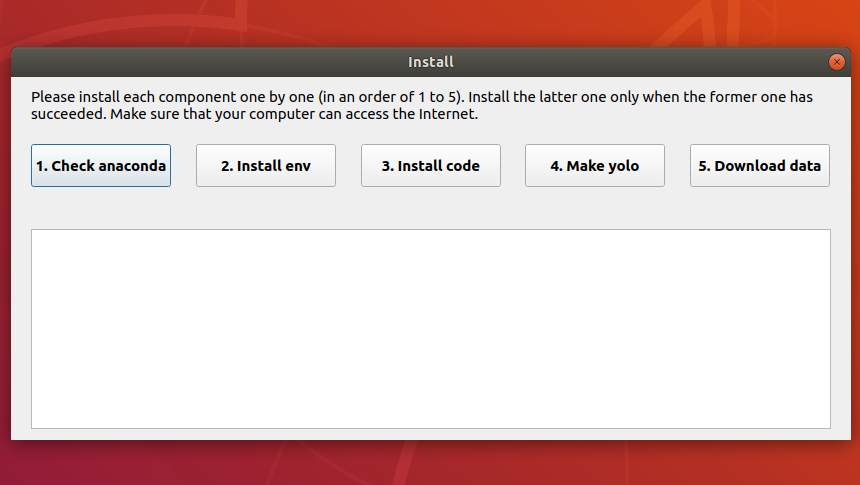

# Installation

## Download or Clone

Download the AlphaTracker repository and rename the main folder from `AlphaTracker-main` to `Alphatracker`. Or you can use `git clone` to clone AlphaTracker repository.

## Install Anaconda

This project is tested in conda env in linux, and thus that is the recommended environment. To install conda, please follow the instructions from the [conda website](https://docs.conda.io/projects/conda/en/latest/user-guide/install/index.html) With conda installed, please set up the environment with the following steps. **Please install anaconda (not miniconda) if you need to use the AlphaTracker GUI.**

## NVIDIA driver

Please make sure that your NVIDIA driver version  >= 450. You can download Nvidia driver for your computer at [nvidia website](https://www.nvidia.com/Download/index.aspx).

## Install AlphaTracker
### By GUI (recommended for non-cs users)
<div align="center">
    <br>
    <br>
    AlphaTracker GUI and installation page
</div>

Download our GUI app (main_ui) at [here](https://github.com/MVIG-SJTU/AlphaTracker/releases). Please visit our video tutorial for installation at [YouTube](https://youtu.be/fQ1bSoAkV5o).


### Or by command line
In your command window, locate the terminal prompt. Open this application. Then, find the folder that contains the `AlphaTracker` repository that you just downloaded. Then inside the terminal window, change the directory as follows: `cd /path/to/AlphaTracker`. 

Then run the following command:

```bash
bash scripts/install.sh
```

<br>

