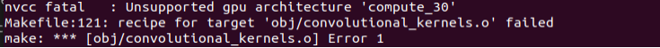

# Q&A

- AttributeError: module 'scipy.misc' has no attribute 'imread'
  `python3 -m pip install --upgrade Pillow`

- Cannot install / import torch, or cannot use cuda

  This may due to your cuda version. Please refer to https://pytorch.org/ to re-install pytorch that meets with your cuda version.

- When import cv2, meet this problem: ImportError: libopenh264.so.5: cannot open shared object file: No such file or directory

  `cp ~/anaconda3/envs/alphatracker/lib/libopenh264.so.6 ~/anaconda3/envs/alphatracker/lib/libopenh264.so.5`

- When make, meet this problem:

  

  First check whether you have installed nvcc: `cd /usr/local/cuda/bin && ls` 

  If there does exist nvcc, then run `vi ~/.bashrc`, and press i to enter insert mode. Then write this sentence to the end line: `export PATH=$PATH:/usr/local/cuda/bin`, then press "Esc" and press "shift" + ":", then input "wq" and "Enter" to save the changes. After that, make a new terminal to make again.

  If there does not exist nvcc, you can install it by `sudo apt-get install nvidia-cuda-toolkit`

- When make darknet, meet nvcc fatal problems like this:

  

  This is due to cuda version difference. Please open `Tracking/AlphaTracker/train_yolo/darknet/Makefile`, and change the `ARCH` according to your cuda version and following the commented instructions. We give an default example for CUDA 11.1 there.