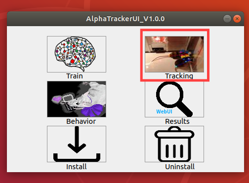
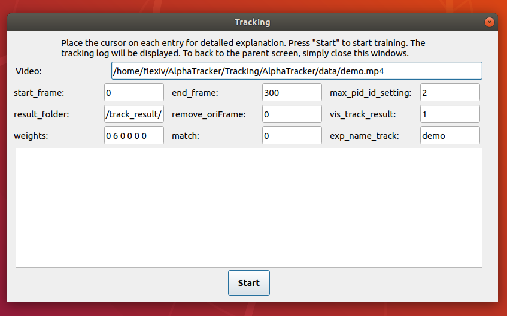

# Tracking
## By GUI (recommended for non-cs users)
<div align="center">
    <br>
    <br>
    AlphaTracker GUI tracking page
</div>

Please visit our video tutorial for tracking at [YouTube](https://youtu.be/t2skgohliAc).

<br>

## Or by command line
### Step 1. Configuration

Before tracking, you need to change the parameters in [Tracking/AlphaTracker/setting.py](../Tracking/AlphaTracker/setting.py) (blue block in Figure 2). The meaning of
the parameters can be found in the comments.

We will use a trained weight to track a demo video by default.

### Step 2. Running the code

Change directory to the [alphatracker folder](../Tracking/AlphaTracker/) and run the following command line to do tracking:
```bash
# if your current virtual environment is not alphatracker
# run this command first: conda activate alphatracker
python track.py
```

### General Notes about the Parameters:
1. Remember not to include any spaces or parentheses in your file names. Also, file names are case-sensitive. 
2. For training the parameter num_mouse must include the same number of items as the number of json files
that have annotated data. For example if you have one json file with annotated data for 3 animals then
```num_mouse=[3]``` if you have two json files with annoted data for 3 animals then ```num_mouse=[3,3]```.
3. ```sppe_lr``` is the learning rate for the SAPE network. If your network is not performing well you can lower this
number and try retraining
4. ```sppe_epoch``` is the number of training epochs that the SAPE network does. More epochs will take longer but
can potentially lead to better performance.

<br>


# Training (Not Sup)

### **Note:** 

We do not support training detector on Windows yet. Please use our demo model weights or you can refer to Linux version.

### Demo data for training

If you want to test AlphaTracker's training without annotating your own data, here we provide 600 frames of two unmarked mice interacting in a homecage annotated:

https://drive.google.com/file/d/1TYIXYYIkDDQQ6KRPqforrup_rtS0YetR/view?usp=sharing

### Demo weights for tracking 

There is a demo video in [Tracking/Alphatracker/data](../Tracking/Alphatracker/data) that you can use for tracking. If you want to use the trained network we provide to track this video set `exp_name=demo` in the [Tracking/AlphaTracker/setting.py](../Tracking/AlphaTracker/setting.py)

